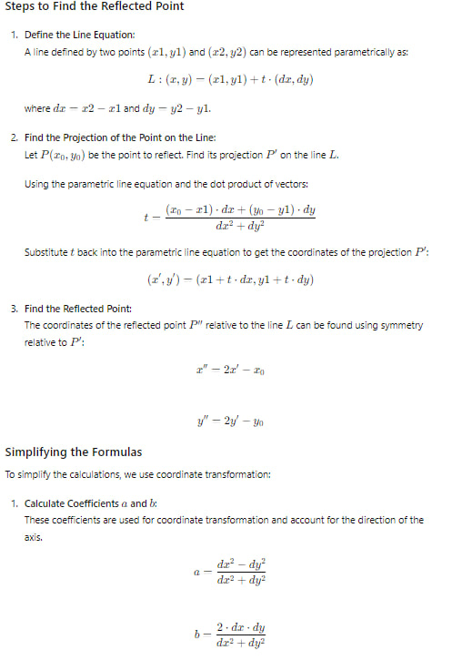

# Polygon-Symmetry
Finding the axes of symmetry of a convex polygon

<h3>Description:</h3>
A convex polygon (closed polyline) is given in 2D by the list of nodes’ coordinates.
Implement an algorithm that searches all axes of symmetry for this polygon or reports that
the polygon is non-symmetric.

<h3>Interface:</h3>

The interface is implemented as a console application

Input:
In the command line of which you need to enter the name of the file in which the points in the format lie:

x y

x y

Output:
The axes are output to the console as pairs of points:

x1 y1 - x2 y2

<h3>Stack:</h3>

- ⇒ С++ Standart ISO 20
- ⇒ Google Tests

<h3>Algorithm:</h3>

We go through all the vertices of the polygon and the points midway between neighbouring points, and for each check all the points and halves on the polygon as shown in the picture:

For each obtained line we check whether this line is a symmetry axis for the given polygon. For this purpose, we create a new list of vertices, where we put the reflected vertices of the original polygon. Then we sorit both arrays and check for equality.

To reflect the point, we applied the deduced formulas for the projection of a point onto a line. 

<h3>Tests:</h3>

Tests implemented using the Google Tests framework
